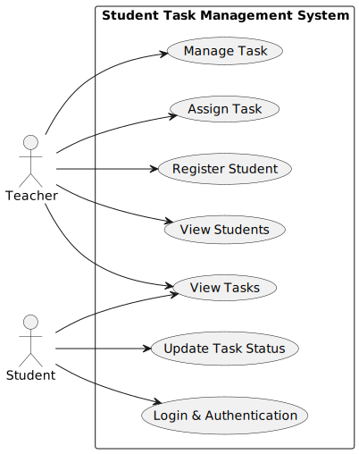
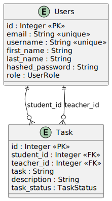

# 📚 Student Task Management System

A full‑stack application designed to **streamline communication between teachers and students**.  
Teachers can register students, assign tasks, and track progress. Students can log in, view tasks, and update their status in real time.

---

## 📝 Problem Statement

Managing student tasks manually can be inefficient and error‑prone.  
The **Student Task Management System** solves this by providing a centralized platform where:

- 👨‍🏫 **Teachers** can add students, assign tasks, and monitor progress.  
- 🎓 **Students** can log in securely, view assigned tasks, and update their status (`PENDING`, `COMPLETED`, `NOTCOMPLETED`).  

This ensures **better accountability, transparency, and productivity** in the learning process.

---

## ⚙️ Features & Workflow

### 👨‍🏫 Teacher Features
- Register new students with details (username, email, name).  
- Assign tasks with descriptions and deadlines.  
- Manage tasks (update, edit, delete).  
- View all tasks and filter by status or student.  
- View all registered students.  

### 🎓 Student Features
- Secure login with credentials.  
- View assigned tasks.  
- Filter tasks by status or teacher.  
- Update task status (`COMPLETED`, `PENDING`, `NOTCOMPLETED`).  

### 🔑 Authentication
- Secure login via `/auth/token`.  
- OAuth2 with password grant.  
- Access token required for protected routes.  

---

## 🔄 Use Case Diagram


---

## 📊 ER Diagram


---

## 🗂️ Project Structure

### Backend
```plaintext
backend/
├── routers/               # API route handlers
│   ├── auth.py
│   ├── student.py
│   ├── teacher.py
│   └── user.py
├── tests/                 # Pytest test cases
├── utils.py
├── database.py
├── main.py
├── models.py
├── schemas.py
├── requirements.txt
└── README.md
```

### Frontend
```plaintext
frontend/
├── public/                    # Static assets (images, diagrams)
│   └── assets/
│       ├── usecase-diagram.png
│       ├── er-diagram.png
│       └── architecture-diagram.png
├── src/
│   ├── components/
│   │   └── Navbar.tsx
│   ├── pages/
│   │   ├── LoginPage.tsx
│   │   ├── RegisterPage.tsx
│   │   ├── StudentDashboard.tsx
│   │   └── StudentsPage.tsx
│   ├── services/
│   │   └── api.ts
│   ├── styles/
│   │   └── main.css
│   ├── App.tsx
│   └── main.tsx
├── package.json
├── vite.config.ts
├── tsconfig.json
└── README.md
```

---

## 📡 API Overview

### Auth
- `POST /auth/token` → Login, returns JWT

### User
- `POST /user/` → Register new user (teacher only)
- `GET /user/` → Get current user info

### Student
- `GET /student/` → Get tasks
- `PATCH /student/{task_id}` → Update task status

### Teacher
- `POST /teacher/` → Create task
- `GET /teacher/` → Get tasks
- `PUT /teacher/{task_id}` → Update task
- `DELETE /teacher/{task_id}` → Delete task
- `GET /teacher/students` → Get all students

---

## 📊 Component Workflows

### Navbar
- Role-based navigation (Student → Dashboard, Teacher → Students/Register)
- Logout clears localStorage and redirects to `/login`

### LoginPage
- Authenticates via `login()`
- Decodes JWT → stores role, id, username
- Redirects based on role

### RegisterPage (Teacher-only)
- Teachers can register new users
- Calls `registerUser()`
- Redirects back to `/students`

### StudentDashboard
- Loads tasks via `getStudentTasks()`
- Displays statistics (total, completed, pending, not completed)
- Allows filtering and updating task status

### StudentsPage (Teacher-only)
- Loads students via `getStudents()`
- Teacher selects student → loads tasks
- Supports task CRUD (create, edit, delete)
- Filter tasks by status

---

## 🧪 Testing

- **Backend**: Pytest (unit + integration tests)  
- **Frontend**: Jest + React Testing Library  

Run backend tests:
```bash
pytest
```

Run frontend tests:
```bash
npm test
```

---

## ⚙️ Getting Started

### Backend
```bash
cd backend
python -m venv .venv
source .venv/bin/activate   # Linux/Mac
.venv\Scripts\activate      # Windows
pip install -r requirements.txt
uvicorn main:app --reload --port 8080
```
- Swagger UI → `http://localhost:8080/docs`  
- ReDoc → `http://localhost:8080/redoc`  

### Frontend
```bash
cd frontend
npm install
npm run dev
```
- Local Dev → `http://localhost:5173`  

---

## 📌 Notes

- Teachers are the only ones allowed to register new users.  
- Students are restricted to their dashboard only.  
- Backend and frontend have **separate README files** for deeper documentation.  
- This README serves as the **unified overview** of the project.  
- Placeholders for **Use Case Diagram, ER Diagram, and Architecture Diagram** are included for future visualization.  

